# ENTSO-E Scarcity Vintage-Stability Audit

**P10 instance:** `entsoe-scarcity-s2`  
**Repository:** `VolMax-Studio/Open-Market-Notes`  
**Audit class:** Internal self-reproduction / vintage-stability audit  
**Claimant:** VolMax Studio  
**Current scientific verdict:** None  
**Current execution state:** Interpretation invalid in `run-003-confirmatory` (frozen parser specification defect); raw acquisition vintage valid  

---

## Overview

This project tests whether a previously published VolMax July 2026 six-zone European scarcity classification can be reconstructed from a single frozen ENTSO-E Transparency Platform acquisition vintage without silent interval repair.

The audit is intentionally narrower than the original market narrative.

It does not claim independent verification of ENTSO-E, a general European scarcity regime, market causality, BESS economics, or the Great Britain leg of the earlier comparison.

It tests two things:

- **Target S — Structural integrity:** Does the preserved public source yield the exact preregistered 15-minute interval population, with zero unexplained missing, duplicate, or unexpected timestamps?
- **Target R — Reproduction:** If Target S passes, does the frozen vintage reproduce the previously published six-zone scarcity classification under the exact historical estimator?

---

## Why this repository exists

The project was created after an earlier approach (`entsoe-scarcity-s1`) was abandoned because monthly chunking and boundary handling could silently alter the observed population.

`s2` replaces that approach with a stricter architecture:
- preregister before confirmatory execution;
- freeze the request contract and executable harness;
- preserve raw public responses byte-for-byte;
- hash all evidentiary artifacts;
- require exact MTU counts rather than percentage completeness;
- prohibit interpolation, silent deduplication, adaptive chunking, and post-hoc request changes;
- stop on unresolved evidence instead of repairing it during the run.

---

## Audit workflow

```mermaid
flowchart LR
    A["Published VolMax Note #003 result"]
    B["Draft preregistration"]
    C["Claude read-only pre-execution Gate"]
    D["Operator acceptance"]
    E["Frozen PREREG_SHA"]
    F["Ananke official acquisition"]
    G["Raw bytes + SHA-256 evidence"]
    H["Target S: exact MTU structure"]
    I["Target R: classification reproduction"]
    J["Claude post-execution Gate"]
    K["Operator ratification"]
    L["FAILURES.md"]
    M["New prereg version"]

    A --> B
    B --> C
    C --> D
    D --> E
    E --> F
    F --> G
    G --> H
    H --> I
    I --> J
    J --> K

    F -. "unexpected source or execution condition" .-> L
    H -. "structural failure" .-> L
    J -. "gate finding" .-> L
    L --> M
    M --> C
```



The failure path is deliberate. A halted run is preserved as evidence and cannot be silently rewritten into a successful run.

---

## Frozen measurement design

### Zones

| Zone | ENTSO-E area identifier |
| :--- | :--- |
| **AT** | `10YAT-APG------L` |
| **BE** | `10YBE----------2` |
| **DK-1** | `10YDK-1--------W` |
| **DK-2** | `10YDK-2--------M` |
| **FR** | `10YFR-RTE------C` |
| **NL** | `10YNL----------L` |

### Source
- ENTSO-E Transparency Platform Web API
- `documentType=A85` — imbalance prices
- `A16` realised-process semantics validated from the returned document
- Price category: `<imbalance_Price.category>A04</imbalance_Price.category>` (Shortage / deficit imbalance price)
- raw public response preserved before interpretation

### Windows

| Window | UTC request period | Expected PT15M intervals / zone |
| :--- | :--- | :--- |
| **Baseline** | `202507312200` $\rightarrow$ `202606302200` | 32,064 |
| **July 2026 target** | `202606302200` $\rightarrow$ `202607312200` | 2,976 |

Exactly 12 requests are preregistered (6 zones $\times$ 2 windows).  
No monthly chunking and no adaptive date-window retry are permitted inside an official run.

---

## Structural gate — Target S

For every zone and window, the expected UTC grid is constructed independently of the source payload.

A structurally admissible population requires:
```text
missing timestamps    = 0
duplicate timestamps  = 0
unexpected timestamps = 0
resolution            = PT15M
document identity     = A85
process semantics     = A16
```

A percentage such as “99.9% complete” is not a substitute for this invariant.  
No interpolation, forward fill, backward fill, silent deduplication, boundary clipping, or synthetic MTU creation is allowed.

---

## Reproduction estimator — Target R

Only structurally admissible zones may enter Target R.

The historical threshold estimator is frozen as:
```python
R_z = float(
    pd.Series(B_z).quantile(
        0.90,
        interpolation="linear"
    )
)
```

July occupancy is then:
$$M_z = \frac{\text{count}(\text{price} \ge R_z)}{2,976}$$

Classification:
$$\text{ELEVATED} \iff M_z \ge 0.15 \quad (15.0\%)$$
$$\text{NOT\_ELEVATED} \iff M_z < 0.15$$

The previously published values are comparison outputs only. They are never used as estimator inputs.

---

## Run history

### `run-001-confirmatory`
- **Disposition:** `Exploratory (Protocol Non-Compliance)`
- The run preserved useful raw observations, but it cannot carry a confirmatory result because the execution harness was authored after the governing preregistration freeze.
- It also exposed a wrong Belgian area identifier (`10YBE----------X`) and an overly broad HALT classifier.
- The run is preserved; it is not repaired retroactively.

### `run-002-confirmatory`
- **Disposition:** `Halted outside taxonomy` (Specification boundary failure)
- **Governing preregistration:** `98929035eb86a6f65a83fc4538a732e98f13912a`
- **Evidence commit:** `1a53d688b1f41bf56ca01062b0c3ffb9cf1ba895`
- Acquisition: 12/12 HTTP 200 OK.
- Interpretation: Halted due to PKZip container format unhandled by frozen v2 parser.

### `run-003-confirmatory`
- **Disposition:** `Acquisition valid — interpretation invalid (frozen parser specification defect)`
- **Governing preregistration:** `d9dfbbada85100243ba0150835d824c1c68629cd`
- **Evidence commit:** `9a68ed467f56cf8f1155986fc0d17676c66cf1d2`
- **Acquisition result:**
  - 12 / 12 requests returned HTTP 200.
  - The complete 12-response acquisition batch exists as a frozen public vintage.
  - Raw payload hashes match the recorded run metadata.
- **Interpretation result:**
  - Multi-Period iteration defect (`ts.find('.//ns:Period')` read only the first `<Period>` per `<TimeSeries>`).
  - Missing category filter: parsed both `A04` (Shortage) and `A05` (Surplus) series without distinguishing `<imbalance_Price.category>`, producing duplicate timestamps.
  - Target S outputs from `run-003` are artifacts of the parser and are **not scientifically interpretable**.

---

## Current boundary: B-21 / B-23 / B-24

The v4 preregistration defines:
- Iteration over all `<Period>` children within each `<TimeSeries>`;
- Extraction of timestamp from each `<Period>`'s own `timeInterval/start`;
- Selection of shortage price series strictly via `<imbalance_Price.category>A04</imbalance_Price.category>`;
- Execution of `run-004-confirmatory` as an offline interpretation run over the preserved `run-003` raw vintage.

---

## Evidence layout

Each official run is expected to preserve:
```text
evidence/runs/<RUN_ID>/
├── command.sh
├── stdout.log
├── stderr.log
├── exit_code.txt
├── env.txt
├── git_commit.txt
├── inputs.sha256
├── outputs.sha256
├── run_metadata.json
└── raw/
```

Derived listings and document inventories are added only after structurally valid parsing.  
Raw artifacts and literal logs outrank narrative summaries.

---

## Governance

| Role | Responsibility |
| :--- | :--- |
| **Ivan** | Human Operator; sole final ratifier |
| **Sol** | Research Lead; claim decomposition, preregistration, methods, interpretation |
| **Claude** | Read-only adversarial Gate |
| **Ananke** | Ops Custodian; Git, hashes, execution, evidence packaging |

A model does not self-ratify.  
Human merge / explicit acceptance is the governance boundary for ratification.

---

## Controlled P10 verdicts

The project uses only the following scientific verdict vocabulary:
- `Verified`
- `Verified with Limitations`
- `Not Verified`
- `Not Demonstrated`
- `Unfalsifiable-as-Stated`
- `Deferred`

---

## Final Ratification Record

- **Operator:** Ivan Nestorov
- **Instance:** `entsoe-scarcity-s2`
- **Canonical Evaluated Run:** `run-005-recreation`
- **Governing PREREG_SHA_v4:** `88c7959e3dae0eb8cb5ad49640424d368e625eea`
- **Evidence Commit:** `f2d39e67aa21448b111db09df70da72c544e5904`
- **Controlled P10 Verdict:** **`Not Demonstrated`**
- **Process Status:** `Ratified & Closed`

### Ratified Finding

Under the frozen ENTSO-E Transparency Platform vintage and the preregistered A85/A16/PT15M interpretation rules, none of the twelve zone/window populations satisfied the exact Target S interval-population invariant.

All twelve evaluated populations contained one or more missing expected MTUs from the public source response.

Across all twelve populations:
- **Duplicate registered UTC MTUs:** `0`
- **Unexpected registered UTC MTUs:** `0`
- **Document identity (`documentType=A85`):** Satisfied (`100%`)
- **Process semantics (`processType=A16`):** Satisfied (`100%`)
- **Interval resolution (`resolution=PT15M`):** Satisfied (`100%`)
- **Price direction filtering (`category=A04`):** Satisfied (`100%`)

Because every zone failed the preregistered structural Target S gate, Target R was `NOT_EVALUATED` for all six zones.

The previously published July-2026 six-zone European scarcity classification was therefore not reproduced or contradicted by this instance. Its reproduction is formally classified as:

$$\text{Verdict: }\mathbf{Not\ Demonstrated}$$

under the evidentiary boundary of this audit.

---

## Empirical Results: Missing MTU Rate by Zone

```text
Missing MTU Rate (% of expected population missing from source payload)

Zone    July 2026 Target (31 days)           Baseline (334 days)
----------------------------------------------------------------------
AT      [#] 0.40% (12 / 2,976)               [#] 0.72% (230 / 32,064)
BE      [##] 1.48% (44 / 2,976)              [####] 4.64% (1,487 / 32,064)
DK-1    [####] 3.66% (109 / 2,976)           [####] 3.56% (1,142 / 32,064)
DK-2    [###] 2.28% (68 / 2,976)             [####] 3.78% (1,212 / 32,064)
FR      [######] 5.85% (174 / 2,976)         [####] 3.22% (1,033 / 32,064)
NL      [##########] 9.27% (276 / 2,976)     [############] 12.11% (3,884 / 32,064)
```

### Measured Target S Population Summary

| Zone | Area EIC | Baseline Observed | Baseline Missing | Baseline Missing % | Target Observed | Target Missing | Target Missing % | Duplicates | Target S |
| :--- | :--- | :--- | :--- | :--- | :--- | :--- | :--- | :--- | :--- |
| **AT** | `10YAT-APG------L` | 31,834 / 32,064 | 230 | 0.72% | 2,964 / 2,976 | 12 | 0.40% | 0 | **S-FAIL** |
| **BE** | `10YBE----------2` | 30,577 / 32,064 | 1,487 | 4.64% | 2,932 / 2,976 | 44 | 1.48% | 0 | **S-FAIL** |
| **DK-1** | `10YDK-1--------W` | 30,922 / 32,064 | 1,142 | 3.56% | 2,867 / 2,976 | 109 | 3.66% | 0 | **S-FAIL** |
| **DK-2** | `10YDK-2--------M` | 30,852 / 32,064 | 1,212 | 3.78% | 2,908 / 2,976 | 68 | 2.28% | 0 | **S-FAIL** |
| **FR** | `10YFR-RTE------C` | 31,031 / 32,064 | 1,033 | 3.22% | 2,802 / 2,976 | 174 | 5.85% | 0 | **S-FAIL** |
| **NL** | `10YNL----------L` | 28,180 / 32,064 | 3,884 | 12.11% | 2,700 / 2,976 | 276 | 9.27% | 0 | **S-FAIL** |

---

## Strict Evidentiary Limitations (§15 Invariant)

> [!IMPORTANT]
> The finding establishes only that the frozen public source response, under the frozen request and interpretation contract, did not provide the complete preregistered interval population.
> 
> It **does not** establish:
> - that ENTSO-E's underlying databases lack those intervals;
> - that an originating Transmission System Operator (TSO) failed to measure or report them;
> - why the intervals are absent from the returned API payload;
> - that the previously published scarcity classification is false.
> 
> In accordance with the preregistered protocol, **zero missing intervals were interpolated, forward-filled, repaired, or excluded from the denominator.**


---

## License / data note

The audit is built around public ENTSO-E Transparency Platform evidence.  
Repository policy is to prefer manifests, hashes, and provenance records over unnecessary redistribution of source data. Legacy raw-data packaging issues are tracked separately in `FAILURES.md` and do not alter the evidentiary status of this instance.

---

## Citation

If this audit is later archived or released with a DOI, the canonical citation and exact release commit should be added here only after the DOI $\rightarrow$ release $\rightarrow$ commit binding is explicitly recorded.
