# ENTSO-E Scarcity Vintage-Stability Audit

**P10 instance:** `entsoe-scarcity-s2`  
**Repository:** `VolMax-Studio/Open-Market-Notes`  
**Audit class:** Internal self-reproduction / vintage-stability audit  
**Claimant:** VolMax Studio  
**Current scientific verdict:** None  
**Current execution state:** HALT after clean acquisition in `run-002-confirmatory`  

---

## Overview

This project tests whether a previously published VolMax July 2026 six-zone European scarcity classification can be reconstructed from a single frozen ENTSO-E Transparency Platform acquisition vintage without silent interval repair.

The audit is intentionally narrower than the original market narrative.

It does not claim independent verification of ENTSO-E, a general European scarcity regime, market causality, BESS economics, or the Great Britain leg of the earlier comparison.

It tests two things:

- **Target S — Structural integrity:** Does the preserved public source yield the exact preregistered 15-minute interval population, with zero unexplained missing, duplicate, or unexpected timestamps?
- **Target R — Reproduction:** If Target S passes, does the frozen vintage reproduce the previously published six-zone scarcity classification under the exact historical estimator?

---

## Why this repository exists

The project was created after an earlier approach (`entsoe-scarcity-s1`) was abandoned because monthly chunking and boundary handling could silently alter the observed population.

`s2` replaces that approach with a stricter architecture:
- preregister before confirmatory execution;
- freeze the request contract and executable harness;
- preserve raw public responses byte-for-byte;
- hash all evidentiary artifacts;
- require exact MTU counts rather than percentage completeness;
- prohibit interpolation, silent deduplication, adaptive chunking, and post-hoc request changes;
- stop on unresolved evidence instead of repairing it during the run.

---

## Audit workflow

```mermaid
flowchart LR
    A["Published VolMax Note #003 result"]
    B["Draft preregistration"]
    C["Claude read-only pre-execution Gate"]
    D["Operator acceptance"]
    E["Frozen PREREG_SHA"]
    F["Ananke official acquisition"]
    G["Raw bytes + SHA-256 evidence"]
    H["Target S: exact MTU structure"]
    I["Target R: classification reproduction"]
    J["Claude post-execution Gate"]
    K["Operator ratification"]
    L["FAILURES.md"]
    M["New prereg version"]

    A --> B
    B --> C
    C --> D
    D --> E
    E --> F
    F --> G
    G --> H
    H --> I
    I --> J
    J --> K

    F -. "unexpected source or execution condition" .-> L
    H -. "structural failure" .-> L
    J -. "gate finding" .-> L
    L --> M
    M --> C
```



The failure path is deliberate. A halted run is preserved as evidence and cannot be silently rewritten into a successful run.

---

## Frozen measurement design

### Zones

| Zone | ENTSO-E area identifier |
| :--- | :--- |
| **AT** | `10YAT-APG------L` |
| **BE** | `10YBE----------2` |
| **DK-1** | `10YDK-1--------W` |
| **DK-2** | `10YDK-2--------M` |
| **FR** | `10YFR-RTE------C` |
| **NL** | `10YNL----------L` |

### Source
- ENTSO-E Transparency Platform Web API
- `documentType=A85` — imbalance prices
- `A16` realised-process semantics validated from the returned document
- raw public response preserved before interpretation

### Windows

| Window | UTC request period | Expected PT15M intervals / zone |
| :--- | :--- | :--- |
| **Baseline** | `202507312200` $\rightarrow$ `202606302200` | 32,064 |
| **July 2026 target** | `202606302200` $\rightarrow$ `202607312200` | 2,976 |

Exactly 12 requests are preregistered (6 zones $\times$ 2 windows).  
No monthly chunking and no adaptive date-window retry are permitted inside an official run.

---

## Structural gate — Target S

For every zone and window, the expected UTC grid is constructed independently of the source payload.

A structurally admissible population requires:
```text
missing timestamps    = 0
duplicate timestamps  = 0
unexpected timestamps = 0
resolution            = PT15M
document identity     = A85
process semantics     = A16
```

A percentage such as “99.9% complete” is not a substitute for this invariant.  
No interpolation, forward fill, backward fill, silent deduplication, boundary clipping, or synthetic MTU creation is allowed.

---

## Reproduction estimator — Target R

Only structurally admissible zones may enter Target R.

The historical threshold estimator is frozen as:
```python
R_z = float(
    pd.Series(B_z).quantile(
        0.90,
        interpolation="linear"
    )
)
```

July occupancy is then:
$$M_z = \frac{\text{count}(\text{price} \ge R_z)}{2,976}$$

Classification:
$$\text{ELEVATED} \iff M_z \ge 0.15 \quad (15.0\%)$$
$$\text{NOT\_ELEVATED} \iff M_z < 0.15$$

The previously published values are comparison outputs only. They are never used as estimator inputs.

---

## Run history

### `run-001-confirmatory`
- **Disposition:** `Exploratory (Protocol Non-Compliance)`
- The run preserved useful raw observations, but it cannot carry a confirmatory result because the execution harness was authored after the governing preregistration freeze.
- It also exposed a wrong Belgian area identifier and an overly broad HALT classifier.
- The run is preserved; it is not repaired retroactively.

### `run-002-confirmatory`
- **Governing preregistration:** `98929035eb86a6f65a83fc4538a732e98f13912a`
- **Evidence commit:** `1a53d688b1f41bf56ca01062b0c3ffb9cf1ba895`
- **Acquisition result:**
  - 12 / 12 preregistered requests returned HTTP 200.
  - The 334-day request succeeded for all six zones.
  - All raw responses were preserved and hashed before parsing.
  - The corrected BE identifier was empirically confirmed by a successful response.
- **Interpretation result:**
  - The source returned PKZip containers, not direct XML bytes.
  - The frozen v2 parser attempted to pass the ZIP payload directly to the XML parser and stopped with a parse error.
  - This is classified as a specification boundary failure, not a source-data result.
  - No Target S or Target R result was issued.

---

## What `run-002` established

The following findings survive the halted interpretation stage:
- ENTSO-E accepted the full preregistered 334-day baseline request for all six zones.
- All six corrected area identifiers produced HTTP 200 responses.
- The complete 12-response acquisition batch exists as a frozen public vintage.
- Raw payload hashes match the recorded run metadata.
- The acquisition layer completed without adaptive chunking, request changes, or silent repair.
- The returned transport format is ZIP.
- Some ZIP payloads contain multiple market-document members, which requires an explicitly frozen merge rule before interpretation.

What it did not establish:
- exact MTU completeness;
- scarcity occupancy;
- reproduction of the five-of-six classification;
- a P10 scientific verdict.

---

## Current boundary: B-19 / B-20

The next preregistration version must explicitly define:
- ZIP detection and extraction;
- deterministic member ordering;
- preservation and hashing of extracted members;
- multi-document merge rules;
- revision handling;
- duplicate-MTU behavior across ZIP members;
- a frozen outcome for unexpected payload/container formats.

The existing `run-002` raw vintage can potentially be reused for interpretation, but that choice must itself be preregistered and gated before execution.

---

## Evidence layout

Each official run is expected to preserve:
```text
evidence/runs/<RUN_ID>/
├── command.sh
├── stdout.log
├── stderr.log
├── exit_code.txt
├── env.txt
├── git_commit.txt
├── inputs.sha256
├── outputs.sha256
├── run_metadata.json
└── raw/
```

Derived listings and document inventories are added only after structurally valid parsing.  
Raw artifacts and literal logs outrank narrative summaries.

---

## Governance

| Role | Responsibility |
| :--- | :--- |
| **Ivan** | Human Operator; sole final ratifier |
| **Sol** | Research Lead; claim decomposition, preregistration, methods, interpretation |
| **Claude** | Read-only adversarial Gate |
| **Ananke** | Ops Custodian; Git, hashes, execution, evidence packaging |

A model does not self-ratify.  
Human merge / explicit acceptance is the governance boundary for ratification.

---

## Controlled P10 verdicts

The project uses only the following scientific verdict vocabulary:
- `Verified`
- `Verified with Limitations`
- `Not Verified`
- `Not Demonstrated`
- `Unfalsifiable-as-Stated`
- `Deferred`

Execution states such as `HALT`, `Exploratory (not pre-registered)`, `SPREMNO ZA GEJT`, and `Ratified` are not scientific verdicts.  
At the current stage, this instance has no scientific verdict.

---

## Reproducibility principle

This repository distinguishes:
- source acquisition
- artifact preservation
- structural admissibility
- numerical reproduction
- scientific interpretation
- ratification

A successful network request is not a successful audit.  
A deterministic computation is not scientific truth.  
A failed run is not erased when a later run succeeds.

---

## Status

- **Latest completed run:** `run-002-confirmatory`
- **Acquisition:** `COMPLETE (12/12 HTTP 200)`
- **Interpretation:** `HALTED`
- **Target S:** `NOT EVALUATED`
- **Target R:** `NOT EVALUATED`
- **Scientific verdict:** `NONE`
- **Next protocol step:** `prereg v3 → Gate → Operator acceptance → run-003`

---

## License / data note

The audit is built around public ENTSO-E Transparency Platform evidence.  
Repository policy is to prefer manifests, hashes, and provenance records over unnecessary redistribution of source data. Legacy raw-data packaging issues are tracked separately in `FAILURES.md` and do not alter the evidentiary status of this instance.

---

## Citation

If this audit is later archived or released with a DOI, the canonical citation and exact release commit should be added here only after the DOI $\rightarrow$ release $\rightarrow$ commit binding is explicitly recorded.
