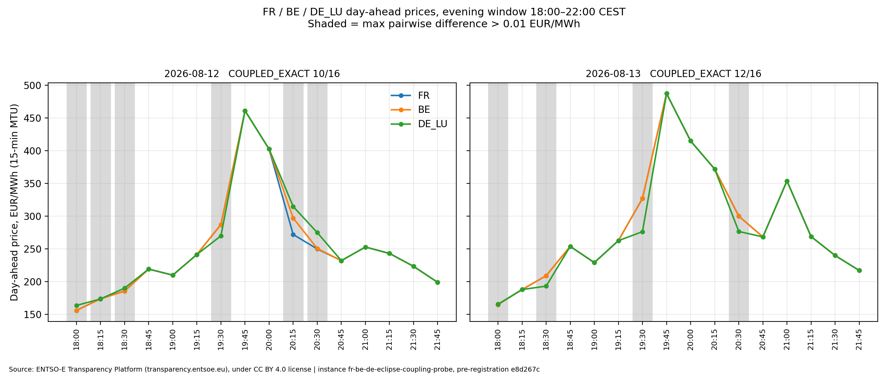

# Instance: FR/BE/DE Day-Ahead Eclipse Coupling & Peak Price Probe

> [!IMPORTANT]
> **5-Point Verification Standard Compliance (P10 Protocol)**

---

## 1. Central Claim
During the 12–13 August 2026 European power market window across France (`FR`), Belgium (`BE`), and Germany-Luxembourg (`DE_LU`), Day-Ahead SDAC prices cleared identically ($\max(\Delta P) \le 0.01\text{ EUR/MWh}$) during the highest 15-minute peak of each day (19:45 CEST), while diverging in 10 of 32 evening lookups (18:00–22:00 CEST) exclusively on intervals below the daily peak. The French hourly peak of 338.86 EUR/MWh occurred on Thursday 13 August 2026 (not Wednesday).

## 2. What Would Falsify It
1. Discovery of non-zero price divergence ($\max(\Delta P) > 0.01\text{ EUR/MWh}$) across `FR`, `BE`, and `DE_LU` during the 19:45 CEST MTU on either 12.08.2026 or 13.08.2026 in primary ENTSO-E Day-Ahead auction clearing data.
2. Arithmetic mean of the four 15-minute French MTUs at delivery hour 20:00 CEST on Thursday 13.08.2026 deviating from 338.86 EUR/MWh by more than 0.01 EUR/MWh ($|P - 338.86| > 0.01$).
3. Any evening inter-zone price divergence occurring on or above the daily maximum price interval.

## 3. Limitations & Boundaries
* **Resolution Floor:** Primary market resolution is 15 minutes (PT15M, 96 MTUs/day).
* **Observation Scope:** Telemetry is strictly bounded to Day-Ahead auction clearing prices (`DocumentType: A44`) for bidding zones `10YFR-RTE------C`, `10YBE----------2`, and `10Y1001A1001A82H` across the 12–13 August 2026 Central European market days.
* **Causality Boundary:** Physical root causes (solar eclipse trajectory, nuclear cooling limits, heatwave load) represent external unmeasured context and are not isolated by this market clearing probe.

## 4. Operational Status
`CLOSED`

## 5. Provenance & Anchor
* **Public Source / API / DOI:** ENTSO-E Transparency Platform (`https://web-api.tp.entsoe.eu/api`), `DocumentType: A44`
* **Verification Method:** Verified live via HTTP GET API response against primary ENTSO-E repository (`http=200` live confirmation on `main`).
* **Verification Timestamp:** 2026-08-30
* **Data License:** Creative Commons Attribution 4.0 International (CC BY 4.0). Mandatory Attribution: *"Source: ENTSO-E Transparency Platform (transparency.entsoe.eu), under CC BY 4.0 license"*.

---

## Structure

```
instances/fr-be-de-eclipse-coupling-probe/
├── PREREGISTRATION.md              # Frozen pre-registration specification
├── README.md                       # Instance overview, protocol, and verdict ledger
├── requirements.txt                # Pinned dependencies for third-party execution
├── results.json                    # Machine-readable aggregate verdicts
├── src/
│   ├── run_audit.py                # Deterministic acquisition & decision runner
│   ├── make_figure.py              # Pure figure generator (reads CSV only)
│   └── reproduce.py                # Single entry-point reproduction runner with hash assertions
├── figures/
│   └── coupling_evening.png        # Generated 2-panel coupling chart
└── data/
    └── coupling_lookups.csv        # Full per-lookup audit table (32 evaluated rows)
```

---

## 6. Claim Decomposition & Falsification Ledger

In accordance with the P10 Verification Standard (L5 Independent Verdict), public statements are decomposed into independently testable assertions evaluated against observable evidence:

| Public Claim Under Test | P10 Disposition / Verdict | Empirical Finding & Observable Boundary |
| :--- | :--- | :--- |
| **French Hourly Peak = 338.86 EUR/MWh (delivery 20:00 CEST)** | **Verified with Limitations** | Arithmetic mean of 4 MTUs at 20:00 CEST equals **338.8625 EUR/MWh** ($|P - 338.86| = 0.0025$), but occurred on **Thursday 13 August 2026**, not Wednesday. (On Wednesday 12 August, hour 20:00 was 289.18 EUR/MWh). |
| **15-Minute Products Reached >400 EUR/MWh** | **Verified** | Confirmed on both dates: Max 15m price reached **461.17 EUR/MWh** on 12.08 at 19:45 CEST, and **487.38 EUR/MWh** on 13.08 at 19:45 CEST. |
| **Evening Prices in FR, BE, DE Reached Exactly the Same Level** | **Not Verified** | Across 32 evening lookups (18:00–22:00 CEST), prices diverged in 10 intervals (max pairwise divergence = **50.77 EUR/MWh** at 19:30 CEST on 13.08). |
| **Multi-Factor Attribution (Solar Eclipse, Heatwave, Nuclear Cooling as Root Cause)** | **Unfalsifiable-as-Stated** | Multi-factor physical causality cannot be isolated from bidding/settlement clearing data without pre-registered physical dispatch models; excluded under Frozen Non-Goals. |

---

## 7. Methodology & Invariants

* **Target Set Derivation:** The evaluation spans 32 tri-zone lookups across two delivery days: 16 MTUs on Date A (2026-08-12, Wednesday - Eclipse Day) and 16 MTUs on Date B (2026-08-13, Thursday - Text Claim Day) during the evening peak window (18:00–22:00 CEST). Input data comprises 576 retrieved 15-minute price records (96 MTUs $\times$ 2 dates $\times$ 3 zones).
* **Coupling Decision Rule:** Each evening MTU evaluates max pairwise divergence:
  $$\max(\Delta P) = \max(|P_{\text{FR}} - P_{\text{BE}}|, |P_{\text{FR}} - P_{\text{DE\_LU}}|, |P_{\text{BE}} - P_{\text{DE\_LU}}|)$$

| Condition | Metric | In-Instance Classification |
| :--- | :--- | :--- |
| $\max(\Delta P) \le 0.01\text{ EUR/MWh}$ | Full SDAC Price Equality | **COUPLED_EXACT** |
| $\max(\Delta P) > 0.01\text{ EUR/MWh}$ | Inter-Zone Divergence | **DIVERGED** |
| Missing / NaN payload | Missing Data | **NULL_VALUED** |
| HTTP error / Schema change | Unresolved Query | **UNRESOLVED** |

---

## 8. Results


*Source: ENTSO-E Transparency Platform (transparency.entsoe.eu), under CC BY 4.0 license | instance fr-be-de-eclipse-coupling-probe, pre-registration e8d267c*

### Machine-Readable Verdict (`results.json`)

```json
{
  "instance": "instances/fr-be-de-eclipse-coupling-probe",
  "preregistration_commit": "e8d267c",
  "status": "CLOSED",
  "target_set": {
    "total_retrieved_points": 576,
    "total_lookups": 32,
    "counts": {
      "COUPLED_EXACT": 22,
      "DIVERGED": 10
    },
    "verdict_ratio": "22/32 COUPLED_EXACT, 10/32 DIVERGED"
  },
  "dates_evaluated": {
    "Date_A_2026-08-12": {
      "date_label": "2026-08-12 (Wednesday - Eclipse Day)",
      "record_count": 96,
      "resolution": "0 days 00:15:00",
      "max_15m_price_fr": 461.17,
      "max_15m_time_cest": "2026-08-12 19:45:00+02:00",
      "max_hourly_mean_price_fr": 300.0,
      "max_hourly_mean_time_cest": "2026-08-12 19:00:00+02:00",
      "hour_20_cest_mean_fr": 289.18,
      "hypothesis_2_peak_338_86_verdict": "PEAK_NOT_CONFIRMED",
      "hypothesis_3_spike_over_400_verdict": "SPIKE_CONFIRMED",
      "evening_window_mtu_total": 16,
      "evening_window_coupled_mtus": 10,
      "evening_window_diverged_mtus": 6,
      "evening_coupling_summary": "COUPLED_EXACT: 10/16, DIVERGED: 6/16"
    },
    "Date_B_2026-08-13": {
      "date_label": "2026-08-13 (Thursday - Text Claim Day)",
      "record_count": 96,
      "resolution": "0 days 00:15:00",
      "max_15m_price_fr": 487.38,
      "max_15m_time_cest": "2026-08-13 19:45:00+02:00",
      "max_hourly_mean_price_fr": 338.8625,
      "max_hourly_mean_time_cest": "2026-08-13 20:00:00+02:00",
      "hour_20_cest_mean_fr": 338.8625,
      "hypothesis_2_peak_338_86_verdict": "PEAK_CONFIRMED",
      "hypothesis_3_spike_over_400_verdict": "SPIKE_CONFIRMED",
      "evening_window_mtu_total": 16,
      "evening_window_coupled_mtus": 12,
      "evening_window_diverged_mtus": 4,
      "evening_coupling_summary": "COUPLED_EXACT: 12/16, DIVERGED: 4/16"
    }
  }
}
```

### Formal Verdict Statement
> *Od 32 večernja 15-minutna intervala u prozoru 18:00–22:00 CEST, 12. i 13. avgusta 2026, cene FR/BE/DE_LU bile su identične unutar 0,01 EUR/MWh u 22 intervala, a razlikovale se u 10. Najviši interval oba dana bio je identičan u sve tri zone. Uzrok razlaza ovim testom nije utvrđen.*

---

## 9. Deterministic Reproduction & Execution Trace

To independently reproduce all findings, verify byte-identical hash matching, and regenerate the audit figure:

```bash
pip install -r requirements.txt
export ENTSOE_API_KEY="your-entsoe-token-here"
python3 src/reproduce.py
```

### Checksums & Byte-for-Byte Invariants
* `results.json`: `0dbaa4bdbcc73df0abade280c0e9ba46e979fa56a605dc921f6704c115bb7227`
* `data/coupling_lookups.csv`: `8ccb9d803e74b202dc5856120c76a0d25d0e1543b132c9d69e98b5e752c7abfe`
* `figures/coupling_evening.png`: `9c6dc66b253344bc7c395e546df7693a6cb6570f50f5416b5b42d75ee4db8079`

---
*VolMax Studio Verification Doctrine — Zero Self-Certification.*
