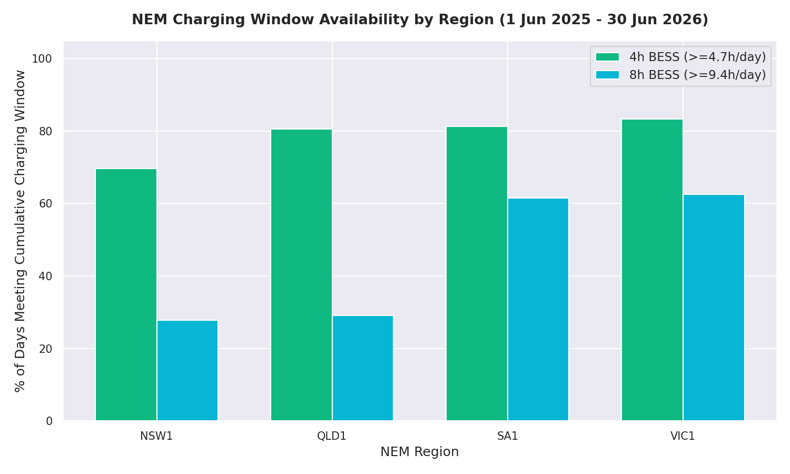
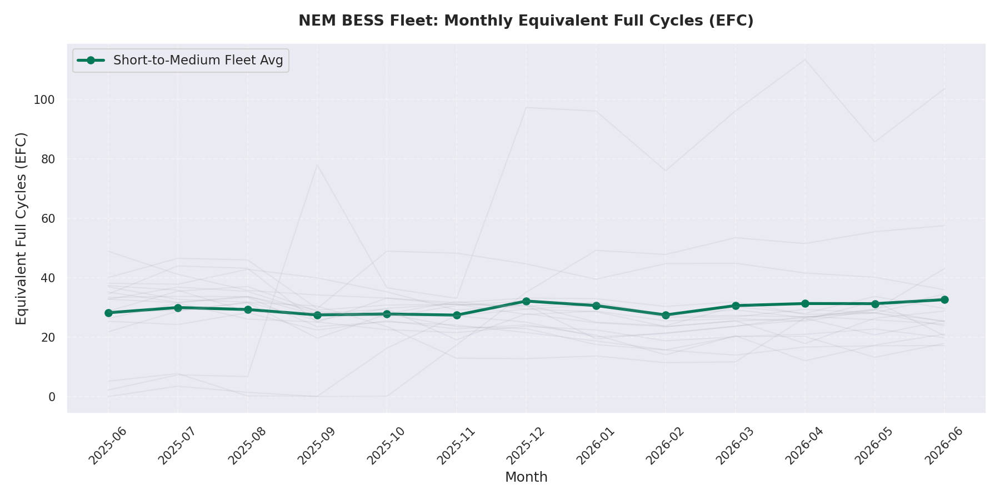

# Note #001: NEM Duration Baseline
**Class of Work:** VolMax Descriptive Analytical Note (Evidence Class A)
**Status:** Completed
**Execution Timestamp:** 2026-07-18T20:52:00+02:00

---

## 1. Provenance & Reproducibility
To ensure absolute mathematical integrity and prevent hindsight bias, all parameters and rules for Note #001 were frozen and committed prior to execution.
- **Frozen Parameters:** [`PARAMS.md`](./PARAMS.md)
- **Frozen Commit:** `b350e9b` (AEMO Dispatch Audit Repository)
- **Primary Data Source:** AEMO 5-Minute Dispatch Price & SCADA Telemetry (1 June 2025 – 30 June 2026)
- **Execution Script:** [`reproduce.py`](./reproduce.py)
- **Verified Output File:** [`results.json`](./results.json)

---

## 2. Metric 1: Scarcity Pricing Duration
*Scarcity is defined as 5-minute Regional Reference Price (RRP) $\ge \$300/\text{MWh}$. Events separated by even 1 interval below \$300/MWh are counted as separate events.*

### Regional Performance Summary (13 Months)
| Region | Total Events | Median Duration | Mean Duration | P90 Duration | Max Duration | Max Timestamp |
|:---|:---:|:---:|:---:|:---:|:---:|:---|
| **NSW1** | 211 | 5.0 min | 22.75 min | 40.0 min | 330 min (5.5h) | 2025-06-26 16:20:00 |
| **QLD1** | 135 | 5.0 min | 17.11 min | 33.0 min | 275 min (4.6h) | 2025-06-12 16:55:00 |
| **SA1** | 533 | 5.0 min | 23.75 min | 29.0 min | 905 min (15.1h) | 2025-07-02 16:25:00 |
| **VIC1** | 156 | 10.0 min | 30.38 min | 62.5 min | 390 min (6.5h) | 2025-06-26 15:30:00 |

### Key Observations
1. **Transiency of Scarcity:** In NSW1, QLD1, and SA1, the median duration is exactly **5.0 minutes** (a single dispatch interval), while in VIC1 the median rises to **10.0 minutes** (two dispatch intervals). This indicates that the vast majority of scarcity events are transient spikes, which favor high-power, short-duration storage assets or fast-response contingency services.
2. **Deep Tail Risk:** While scarcity is typically transient, the tails are significant. South Australia (SA1) experienced a prolonged scarcity event lasting 15 hours and 5 minutes (905 minutes) on 2 July 2025, during a major wind lull and interconnector constraint event.

---

## 3. Metric 2: Charging Window Availability
*We count the percentage of AEMO trading days (04:00 to 04:00 AEST, 395 days total) that provide a cumulative cheap energy window (RRP $\le \$50/\text{MWh}$):*
- **4-Hour BESS:** Requires $\ge 4.7$ hours of cheap energy per day (accounting for 85% round-trip efficiency).
- **8-Hour BESS:** Requires $\ge 9.4$ hours of cheap energy per day (accounting for 85% round-trip efficiency).

### Percentage of Days Meeting Target Charging Window
| Region | 4-Hour BESS Charging Window ($\ge 4.7$h) | 8-Hour BESS Charging Window ($\ge 9.4$h) |
|:---|:---:|:---:|
| **NSW1** | 69.62% | 27.85% |
| **QLD1** | 80.51% | 29.11% |
| **SA1** | 81.27% | 61.52% |
| **VIC1** | 83.29% | 62.53% |

### Key Observations
1. **Strong 4-Hour Viability:** A 4-hour BESS charging window is available on 70% to 83% of all days in the analysis period, indicating that 4-hour systems can reliably perform a daily cycle across the entire mainland NEM.
2. **The Long-Duration Divide:** The availability of charging windows for 8-hour systems reveals a sharp geographic divide. In South Australia (SA1) and Victoria (VIC1), an 8-hour system can find charging windows on over **61-62%** of days, observed alongside high wind and solar penetration. In contrast, in New South Wales (NSW1) and Queensland (QLD1), the 8-hour window is available on only **~28-29%** of days, showing that long-duration storage (LDES) faces steep charging constraints in these grids.

---

## 4. Metric 3: Fleet Cycling Feedback Loop
*We calculate the monthly Equivalent Full Cycles (EFC) across 16 accepted operational BESS assets, stratified by duration:*
- **Short-to-Medium Duration Group ($\le 2$ hours):** 16 units (entire fleet).
- **Long Duration Group ($\ge 4$ hours):** 0 units (no operational assets met this duration in the NEM during the window).

### Fleet Monthly Average Cycling (EFC/month)
- **2025-06:** 28.21
- **2025-07:** 29.97
- **2025-08:** 29.30
- **2025-09:** 27.48
- **2025-10:** 27.80
- **2025-11:** 27.42
- **2025-12:** 32.16
- **2026-01:** 30.63
- **2026-02:** 27.48
- **2026-03:** 30.61
- **2026-04:** 31.32
- **2026-05:** 31.27
- **2026-06:** 32.63

### Key Observations
1. **Highly Stable Fleet Cycling:** The monthly average EFC of the fleet is remarkably stable, ranging between **27.4 and 32.6 cycles per month** (approximately 0.9 to 1.1 cycles per day). This suggests that the operational regime of Australian BESS is structurally anchored to a single daily arbitrage cycle plus minor frequency-regulation throughput.
2. **Absence of Long-Duration Assets:** There are currently no operational $\ge 4$-hour duration BESS assets in our filtered 16-unit analysis subsample, meaning long-duration cycling is not yet represented in our active fleet metrics.

---

## 5. Parametric & Note Changelog
- **Version 1.0.1** (2026-07-19):
  - Corrected Metric 1 summary table in README.md to match the final `results.json` output. (An earlier draft table was hand-transcribed from a superseded, timezone-unfiltered execution run).
  - Clarified Section 4 (Metric 3) observation to note that the absence of long-duration assets applies strictly to our filtered 16-unit analysis subsample rather than the entire market.
  - Aligned causal language in Section 3 (Metric 2) observations to "observed alongside" to comply with VolMax style rules.
  - Added automated Markdown table printing to `reproduce.py` to prevent future transcription discrepancies.

---
*"Every number in this note can be reproduced from the linked code and public data."*
