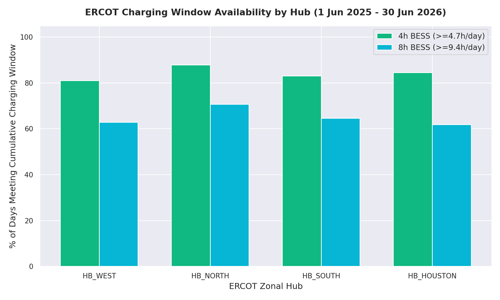

# Note #002: ERCOT Duration Baseline
**Class of Work:** VolMax Descriptive Analytical Note (Evidence Class B — Third-Party GridStatus API)
**Status:** Completed
**Last Recalculated:** 2026-07-19T14:15:00+02:00

---

## 1. Provenance & Reproducibility
To ensure absolute mathematical integrity and prevent hindsight bias, all parameters and rules for Note #002 were frozen and committed prior to execution.
- **Frozen Parameters:** [`PARAMS.md`](./PARAMS.md)
- **Primary Data Source:** ERCOT 15-Minute Real-Time Settlement Point Prices (1 June 2025 – 30 June 2026)
- **Execution Script:** [`reproduce.py`](./reproduce.py)
- **Verified Output File:** [`results.json`](./results.json)
- **Data Ingestion Script:** [`download_ercot_data.py`](./download_ercot_data.py)

---

## 2. Metric 1: Scarcity Pricing Duration
*Scarcity is defined at two levels: Threshold A ($\ge \$100/\text{MWh}$) representing volatility, and Threshold B ($\ge \$250/\text{MWh}$) representing extreme scarcity. Events separated by even 1 interval below the threshold are counted as separate events.*

### Zonal Performance Summary (13 Months)

#### Threshold A: SPP $\ge \$100/\text{MWh}$
| Hub | Total Events | Median Duration | Mean Duration | P90 Duration | Max Duration | Max Timestamp |
|:---|:---:|:---:|:---:|:---:|:---:|:---|
| **HB_WEST** | 161 | 45.0 min | 106.12 min | 180.0 min | 2895 min (48.2h) | 2026-01-24T15:00:00Z |
| **HB_NORTH** | 155 | 30.0 min | 103.35 min | 174.0 min | 2910 min (48.5h) | 2026-01-24T15:00:00Z |
| **HB_SOUTH** | 154 | 30.0 min | 93.31 min | 195.0 min | 1185 min (19.8h) | 2026-01-25T19:00:00Z |
| **HB_HOUSTON** | 154 | 30.0 min | 82.89 min | 180.0 min | 1425 min (23.8h) | 2026-01-25T15:00:00Z |

#### Threshold B: SPP $\ge \$250/\text{MWh}$
| Hub | Total Events | Median Duration | Mean Duration | P90 Duration | Max Duration | Max Timestamp |
|:---|:---:|:---:|:---:|:---:|:---:|:---|
| **HB_WEST** | 35 | 30.0 min | 91.71 min | 159.0 min | 810 min (13.5h) | 2026-01-25T23:15:00Z |
| **HB_NORTH** | 28 | 15.0 min | 94.29 min | 172.5 min | 810 min (13.5h) | 2026-01-25T23:15:00Z |
| **HB_SOUTH** | 30 | 30.0 min | 84.00 min | 196.5 min | 480 min (8.0h) | 2026-01-25T23:30:00Z |
| **HB_HOUSTON** | 29 | 15.0 min | 51.21 min | 135.0 min | 465 min (7.8h) | 2026-01-28T06:15:00Z |

### Key Observations
1. **Transiency of Spikes:** Across all hubs, the median duration of extreme scarcity ($\ge \$250/\text{MWh}$) is **15 to 30 minutes** (1-2 intervals), indicating that peak scarcity pricing remains a highly transient phenomenon. Short-duration batteries ($\le 2$ hours) are well-suited to capture these brief, high-value pricing intervals.
2. **Deep Tail Winter Risks:** While typical events are brief, the extreme tail events are massive. During the winter weather event in late January 2026, the West and North Hubs experienced a continuous pricing block above $\$100/\text{MWh}$ lasting **more than 48 hours** (2895 and 2910 minutes), driven by sustained sub-freezing temperatures and low renewable output. These extended tail events present severe challenges for short-duration storage but represent high-value opportunities for long-duration systems.

---

## 3. Metric 2: Charging Window Availability
*We count the percentage of calendar days (395 days total) that provide a cumulative cheap energy window (SPP $\le \$25/\text{MWh}$):*
- **Operating Day Timezone:** Operating days are defined strictly from 00:00 to 00:00 Central Time (US/Central / `America/Chicago`). The raw `interval_start_utc` timestamps from the dataset are explicitly converted to Central Time to align each interval with its correct local operating day.
- **4-Hour BESS:** Requires $\ge 4.7$ hours of cheap energy per day (accounting for 85% round-trip efficiency).
- **8-Hour BESS:** Requires $\ge 9.4$ hours of cheap energy per day (accounting for 85% round-trip efficiency).

### Percentage of Days Meeting Target Charging Window
| Hub | 4-Hour BESS Charging Window ($\ge 4.7$h) | 8-Hour BESS Charging Window ($\ge 9.4$h) |
|:---|:---:|:---:|
| **HB_WEST** | 81.01% | 62.78% |
| **HB_NORTH** | 87.85% | 70.63% |
| **HB_SOUTH** | 83.04% | 64.56% |
| **HB_HOUSTON** | 84.56% | 61.77% |

### Key Observations
1. **High Charging Reliability:** A 4-hour charging window is available on **81% to 88%** of days across the entire ERCOT grid, indicating that 4-hour systems can reliably perform a daily cycle.
2. **Abundant LDES Charging:** Unlike the NEM, where 8-hour charging windows were restricted to certain regions (~28% in NSW1 and QLD1), ERCOT exhibits widespread charging abundance. An 8-hour window is available on **61% to 71%** of days across *all* four zonal hubs. This is driven by high wind generation in West Texas and rapid solar deployment across the state, ensuring that low-cost charging ($\le \$25/\text{MWh}$) is highly accessible even in major load hubs like HB_HOUSTON and HB_NORTH.

---

## 4. Parametric & Note Changelog
- **Version 1.0.0** (2026-07-19T14:15:00+02:00):
  - Initial publication of ERCOT Duration Baseline.
  - Due to local geoblocking of the primary ERCOT MIS portal, the dataset was retrieved via the `gridstatus.io` API and verified locally. The work is classified as **Evidence Class B**.
  - Generated all Metric 1 and Metric 2 results, markdown tables, and plots.

---
*"Every number in this note can be reproduced from the linked code and public data."*
