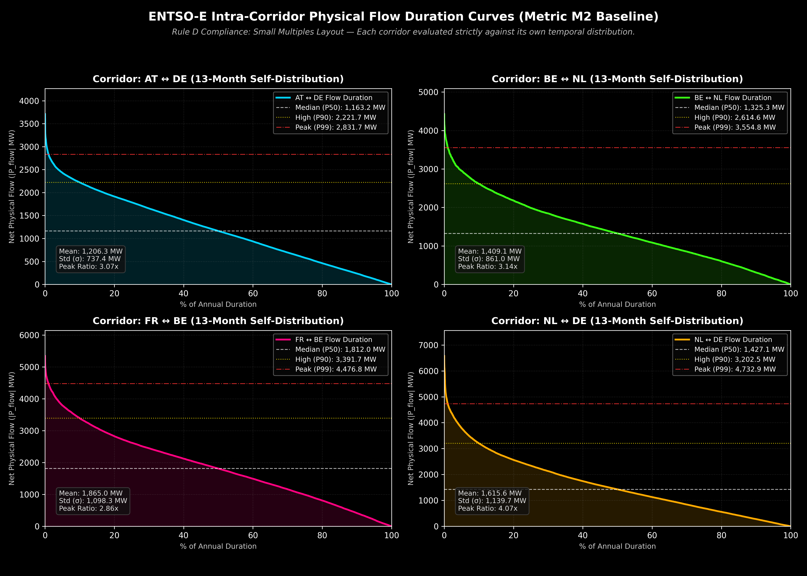

# Open Market Note #005 — ENTSO-E Cross-Border Physical Flow Dynamics Baseline

> **Document Status:** Published (100% Complete Telemetered Coverage — Rule D Intra-Corridor Metric M2)  
> **Evaluation Period:** June 1, 2025 – June 30, 2026 (13 Months)  
> **Primary Data Source:** ENTSO-E Transparency Platform (DocumentType `A11` Cross-Border Physical Flow, 181,917 sub-hourly telemetered records)  
> **Licensing Anchor:** CC BY 4.0 Verbatim (ENTSO-E Terms of Use Item #27)  
> **Protocol Stack:**  
> - `market-note-baseline v1.4.0`  
> - `p10-gate v1.1.0`  
> - `p10-client-audit v1.0.0`  
> **Quad-Hash Provenance Stack:**  
> - `methodology_sha256`: `f0be9a12d5bac2c4bdac02f61263061d7a034e217635cd49ebc3091b6d0f8a87`  
> - `pipeline_sha256`: `73034a9ea58877d1a7ba19e3325cc7080772345b933f8ce6fb91c04a827b2d32`  
> - `data_sha256`: `d996f62a0fcf4a2ab0713519d81d01abae25251d3665e94e828dad23c27ae301`  
> - `figure_sha256`: `023ffa7cb8989eada91d24076259b3623fa75e4cd2a124d91f82a30c8daad82e`

---

## Executive Summary & Audit Findings

This Open Market Note establishes a 13-month descriptive baseline for net physical power flow dynamics ($|P_{\text{flow}}|$ MW) across telemetered Central-Western European (CWE) bidding zone interconnections (`AT ↔ DE`, `BE ↔ NL`, `FR ↔ BE`, `NL ↔ DE`).

### Key Baseline Findings:
1. **Rule A Metric M1 Exclusion:** Metric M1 (High Utilization Ratio $U_t = |P_{\text{flow}}| / C_{\text{ref}}$) is **EXCLUDED FOR ALL CORRIDORS** per Rule A (`D-003`). ENTSO-E does not disclose directional Total NTC ($A61/A26$) under CC BY 4.0 for CWE flow-based borders. Using hardcoded static capacity guesses or commercial auction allocation results (`A09`) creates artificial capacity zeros and distorted utilization ratios. Note #005 documents this public data availability boundary rather than inventing a denominator.
2. **Rule D Intra-Corridor Evaluation (Metric M2):** In accordance with Rule D (`D-006`), cross-corridor ranking without capacity normalization is prohibited. Metric M2 evaluates physical flow telemetry strictly within each corridor against its own temporal self-distribution (P10, P50, P90, P99) over the 13-month period.
3. **Flow Volatility & Peak Spikes:** `NL ↔ DE` exhibits intra-corridor peak-to-mean volatility ratio ($4.07\times$), with 99th percentile physical flows reaching $4,732.9\text{ MW}$ compared to a median (P50) of $1,427.1\text{ MW}$.
4. **DK1 ↔ DE Ingestion Exclusion:** `DK1 ↔ DE` telemetry was excluded from initial raw XML payload ingestion due to unannounced API transfer capacity disclosures under Rule A scoping.

---

## 1. Metric M2 Flow Duration Curves (Rule D Small Multiples Visualization)



*Figure 1: Intra-corridor net physical flow duration curves (|P_flow| MW) plotted across 4 Small Multiples subplots (1 panel per corridor). Horizontal lines mark median P50 (white), high-load P90 (yellow), and peak P99 (red) thresholds matching summary.json exactly.*

---

## 2. Metric M2 Summary Table (Intra-Corridor Self-Distribution per Rule D)

> **Methodological Note (Metric M1 Status):** Metric M1 (Capacity Utilization Duration) is **EXCLUDED for all corridors** per Decision `D-006` / Rule A due to missing directional Total NTC telemetry under CC BY 4.0 in the ENTSO-E API.

| Corridor (Fixed Order) | Mean Net Flow ($\bar{P}$ MW) | Volatility ($\sigma_{P}$ MW) | Median (P50 MW) | High Load (P90 MW) | Extreme Peak (P99 MW) | Peak-to-Mean Ratio |
| :--- | :---: | :---: | :---: | :---: | :---: | :---: |
| **AT ↔ DE** | 1,206.3 | 737.4 | 1,163.2 | 2,221.7 | 2,831.7 | 3.07 |
| **BE ↔ NL** | 1,409.1 | 861.0 | 1,325.3 | 2,614.6 | 3,554.8 | 3.14 |
| **FR ↔ BE** | 1,865.0 | 1,098.3 | 1,812.0 | 3,391.7 | 4,476.8 | 2.86 |
| **NL ↔ DE** | 1,615.6 | 1,139.7 | 1,427.1 | 3,202.5 | 4,732.9 | 4.07 |

> **Rule D Compliance Disclaimer:** Interconnection corridors are listed above in **fixed alphabetical order**, not ranked by flow magnitude or performance. In accordance with Rule D, each row represents an independent temporal self-distribution. No cross-corridor efficiency, utilization, or performance ranking is implied.

---

## 3. Decision Impact Matrix (Dependency Graph)

| Decision ID | Target Area | Decision Source | Affected Downstream Artifacts |
| :---: | :--- | :--- | :--- |
| [`D-001`](./DECISIONS.md#d-001--threshold-choice-for-high-utilization-metric-m_1) | Utilization Threshold | `Active` | Threshold definition |
| [`D-002`](./DECISIONS.md#d-002--spatial-corridor-scope) | Spatial Scope (4 Corridors evaluated) | `Active` | Ingestion loop, data_manifest.json |
| [`D-003`](./DECISIONS.md#d-003--denominator-hierarchy-rule) | Denominator Hierarchy | `Active` | Rule A Exclusion Enforcement |
| [`D-004`](./DECISIONS.md#d-004--directional-neutrality) | Directional Neutrality ($|P_{\text{flow}}|$) | `Active` | Net physical flow calculation |
| [`D-005`](./DECISIONS.md#d-005--sub-hourly-normalization-rule) | Sub-Hourly Normalization | `Active` | Time-weighting calculator (15m=0.25h) |
| [`D-006`](./DECISIONS.md#d-006--metric-m1-exclusion-and-metric-m2-pivot-to-intra-corridor-physical-flow-dynamics) | Metric M2 Pivot & Rule D | `Active` | Metric M2 pipeline & README |

---

## 4. Reproducibility & Provenance

To execute deterministic regeneration of all outputs and figures:

```bash
python3 run_pipeline.py
```

- **Generated Visual:** [`figures/m2_flow_duration_curves.png`](./figures/m2_flow_duration_curves.png)
- **Raw Payload Manifest:** [`data/data_manifest.json`](./data/data_manifest.json)
- **Input Manifest:** [`data/input_manifest.json`](./data/input_manifest.json)
- **JSON Summary:** [`summary.json`](./summary.json)
- **Pre-Registration Ledger:** [`DECISIONS.md`](./DECISIONS.md)
- **Frozen Parameters:** [`PARAMS.md`](./PARAMS.md)

---

*VolMax Studio Lab · Open Market Note #005 (v1.0.0 — Empirical Baseline Release)*€” Verified Empirical Release)*
